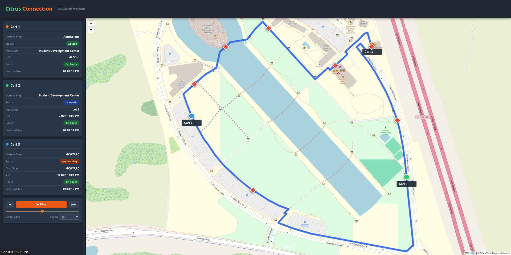
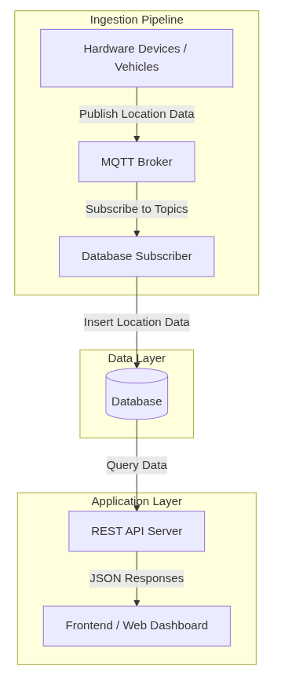

# The Squeeze

Real-time GPS tracking and ETA prediction prototype system built for the Citrus Connections micro-transit fleet. GPS devices publish location data over MQTT, which is ingested into a PostgreSQL/PostGIS database and served through a REST API to a live Leaflet.js dashboard. The system supports multiple vehicles simultaneously and provides per-vehicle ETA estimates, route deviation detection, and server-side caching to minimize database load.

<p align="center">
  
  <br>
  <em>Demo of the system used during our showcase, where we placed 2nd in our category and top 6 out of 50 projects.</em>
</p>

---

## Architecture

<p align="center">
  
</p>

| Component | Directory | Purpose |
|---|---|---|
| MQTT Broker | `backend/mqtt/` | Accepts and authenticates connections from GPS devices |
| DB Subscriber | `backend/mqtt/db/` | Consumes MQTT messages and writes locations to PostgreSQL |
| REST API | `backend/REST/` | Serves locations, routes, and ETAs with server-side caching |
| Route Importer | `backend/routes/` | One-time utility to load GPX route files into PostGIS |
| Frontend | `frontend/` | Static Leaflet.js dashboard |

---

## Prerequisites

- Docker with the Compose plugin
- PostgreSQL with the PostGIS and TimescaleDB extensions enabled
- GPS devices or a publisher capable of sending JSON payloads over MQTT

---

## Database Setup

A full database dump is provided at `capstonedb_dump.sql`. It includes the PostGIS and TimescaleDB extensions and the complete schema. Restore it into an empty database:

```bash
psql -U db_user -d db_name -f capstonedb_dump.sql
```

If you prefer to build the schema manually, the full DDL is documented in `backend/mqtt/db/schema.txt`. The schema consists of five tables:

| Table | Description |
|---|---|
| `devices` | Registered GPS devices (vehicles) |
| `locations` | Individual GPS fixes with device reference and PostGIS point geometry |
| `routes` | Transit routes stored as PostGIS LineString geometries |
| `stops` | Named stops stored as PostGIS point geometries |
| `route_stops` | Junction table mapping stops to routes with ordering |

Devices are registered automatically in the `devices` table on their first MQTT message. The device name is derived from the topic it publishes to (`devices/{name}`).

---

## Running the System

### Docker (recommended)

Create a `.env` file at the project root:

```
MQTT_USERNAME=
MQTT_PASSWORD=
DB_HOST=
DB_PORT=5432
DB_NAME=
DB_USER=
DB_PASSWORD=
```

Then build and start all services:

```bash
docker compose up --build
```

| Service | Port |
|---|---|
| Frontend | `80` |
| MQTT Broker | `1883` |
| REST API | `3000` |

The broker URL for the DB subscriber is set automatically in `docker-compose.yml` and does not need to be in the `.env` file. The database is external — `DB_HOST` should point to the PostgreSQL instance.

To stop all containers:

```bash
docker compose down
```

### Manual

If running without Docker, each service needs Node.js and its own `.env` file.

**`backend/mqtt/.env`**
```
MQTT_USERNAME=
MQTT_PASSWORD=
```

**`backend/mqtt/db/.env`**
```
DB_HOST=
DB_PORT=5432
DB_NAME=
DB_USER=
DB_PASSWORD=
MQTT_USERNAME=
MQTT_PASSWORD=
url=mqtt://localhost:1883
```

**`backend/REST/db/.env`**
```
DB_HOST=
DB_PORT=5432
DB_NAME=
DB_USER=
DB_PASSWORD=
```

**`backend/routes/.env`**
```
DB_HOST=
DB_PORT=5432
DB_NAME=
DB_USER=
DB_PASSWORD=
```

Install dependencies for each service:

```bash
cd backend/mqtt && npm install
cd backend/mqtt/db && npm install
cd backend/REST && npm install
cd backend/routes && npm install
```

Start services in order — each depends on the one before it:

**1. MQTT Broker**
```bash
cd backend/mqtt && node broker.js
```

**2. DB Subscriber**
```bash
cd backend/mqtt/db && node db_subscriber.js
```

**3. REST API**
```bash
cd backend/REST && node server.js
```

**4. Frontend**

Set `API_BASE` at the top of `frontend/app.js` to the public URL of the REST API, then serve `frontend/index.html` with any static file server.

---

## Remote Access

Since all services bind directly to host ports, standard tunneling tools work without any additional configuration.

### Frontend — Tailscale

To expose the dashboard externally:

```bash
tailscale funnel 80
```

### REST API — Tailscale

The frontend fetch calls originate from the user's browser, not the server, so the REST API must be publicly reachable. Set `API_BASE` in `frontend/app.js` to the public URL of the REST API before serving the frontend.

```bash
tailscale funnel 3000
```

### MQTT Broker — ngrok

To allow GPS devices to publish over MQTT from outside the local network:

```bash
ngrok tcp 1883
```

ngrok will provide a public TCP address (e.g. `0.tcp.ngrok.io:12345`). Configure GPS devices to publish to that address instead of a local one.

---

## Route Import

Route and stop data is not included in the database dump and must be imported separately. Place the desired GPX file in `backend/routes/gpx_files/`, then update line 107 of `backend/routes/import_routes.js` with the correct filename and route name:

```js
const result = await importFromGPX('gpx_files/your-route.gpx', 'Route-Name');
```

Then run the importer once:

```bash
cd backend/routes && node import_routes.js
```

This parses the GPX file and inserts the route path as a PostGIS `LineString` and each waypoint as a `Point` into the `routes`, `stops`, and `route_stops` tables.

---

## API Reference

All endpoints return JSON.

| Endpoint | Method | Query Parameters | Description |
|---|---|---|---|
| `/api/latestlocations` | GET | — | Latest GPS fix for every tracked device |
| `/api/routes` | GET | — | All routes with their stops and path coordinates |
| `/api/eta` | GET | `routeId` (required), `startTime`, `endTime` (optional) | Per-vehicle ETA to the next stop on the specified route |
| `/api/locationstatus` | GET | `routeId` (required) | On-course or off-course status per vehicle on the specified route |
| `/api/all` | GET | — | Full location history; intended for development use only |

### Caching

The REST API caches responses server-side to reduce repeated complex PostGIS queries. Cache refresh intervals:

| Data | Interval |
|---|---|
| Routes | 1 hour |
| Latest locations | 1 second |
| ETA (per route) | 5 seconds |
| Location status (per route) | 2 seconds |

### ETA Calculation

ETA is computed by projecting each vehicle's current position onto the route `LineString` using `ST_LineLocatePoint`, calculating speed from a five-reading window, and estimating time to the next stop. Vehicles more than 30 meters from the route path are flagged as off-course.

---

## Database Schema

Full column definitions are in `backend/mqtt/db/schema.txt`. Summary:

| Table | Key Columns |
|---|---|
| `devices` | `id` (serial PK), `name` (text, unique), `created_at` |
| `locations` | `id` (bigint PK), `device_id` (FK → devices), `recorded_at`, `location` (geography Point SRID 4326) |
| `routes` | `route_id` (serial PK), `name`, `path` (geography LineString SRID 4326) |
| `stops` | `stop_id` (serial PK), `name`, `location` (geography Point SRID 4326) |
| `route_stops` | `route_id` (FK), `stop_id` (FK), `stop_order` (int) |
